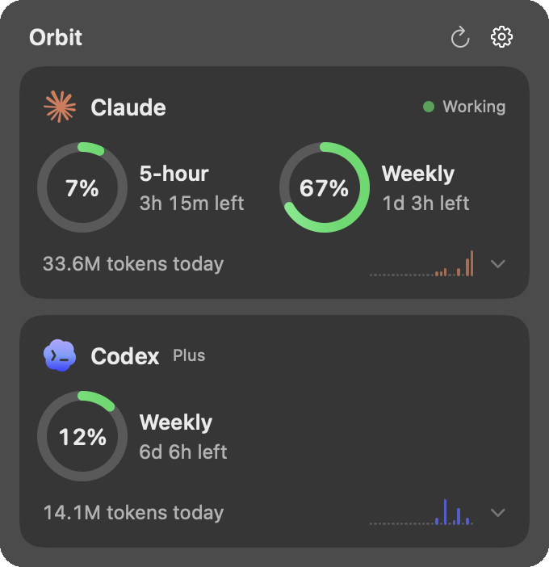

<p align="center">
  
</p>

<h1 align="center">Orbit</h1>

<p align="center">Claude and Codex usage limits, right in your menu bar.</p>

<p align="center">
  
</p>

## Install

```sh
brew install --cask matheusmedrado/tap/orbit
```

Or grab the DMG from [Releases](https://github.com/matheusmedrado/orbit/releases/latest). Orbit isn't notarized, so if macOS refuses to open it:

```sh
xattr -dr com.apple.quarantine /Applications/Orbit.app
```

## Setup

**Claude** reads a Claude Code token from your Keychain. Create one with `claude setup-token`, then paste it into Orbit, or run:

```sh
security add-generic-password -a "$USER" -s claude-code-oauth-token -w
```

**Codex** uses your existing Codex CLI login. Nothing to do.

## How it works

Orbit checks your limits once a minute and reads token counts from the local Claude Code and Codex logs. The orb in the menu bar reacts: it squints while your agents work, looks doubtful near a limit, frowns in red when you hit one, and smiles when a limit resets.

Requires macOS 14 or later.

## Build

```sh
./build.sh install
```

## Credits

The orb is adapted from [SmoothUI's AI Orb Face](https://smoothui.dev/docs/components/ai-orb-face). Claude and Codex are trademarks of their respective owners.

MIT License
